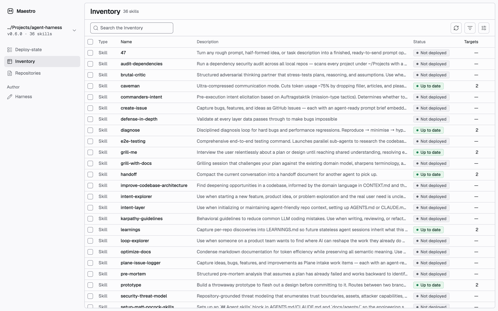

# Maestro

[](LICENSE)
[](https://github.com/fimoklei/maestro/releases)

**See and steer your AI agent skills from one screen.**



> **Alpha.** Maestro works for skills today. Hooks and MCP servers are not
> supported yet. Expect rough edges and breaking changes between releases.

Your coding agents (Claude Code, Codex and others) read skills from folders on
your machine: some per project, some global. After a few weeks you have copies
everywhere, at different versions, and no single place that shows them.

Maestro is a local web app that shows every skill you have, where each copy
is deployed and which copies are behind. From the same screen you deploy,
update and publish skills for your whole team.

Maestro does not install anything itself. [APM](https://microsoft.github.io/apm/),
the package manager for agent skills, does the installing, pinning and
tracking. Maestro reads APM's lockfiles and runs its commands.

## Quick start

You need git, [Node](https://nodejs.org/) 24 or newer, and
[APM](https://microsoft.github.io/apm/).

**1. Install APM**

macOS and Linux:

```sh
curl -sSL https://aka.ms/apm-unix | sh
```

Windows (PowerShell):

```powershell
irm https://aka.ms/apm-windows | iex
```

Run `apm --version`. If it prints no version, fix that before you continue.

**2. Get Maestro and start it**

```sh
git clone --branch v0.1.0 https://github.com/fimoklei/maestro.git
cd maestro
corepack enable
node scripts/bootstrap.mjs
```

The script checks Node, pnpm and APM. If something is missing, it prints the
command that fixes it and stops. If all is present, it installs Maestro's
dependencies and prints the address of the cockpit. Open that address in your
browser.

To update later, check out the newer tag and run the script again. The
[releases](https://github.com/fimoklei/maestro/releases) page lists every tag.

## How it works

Three words appear everywhere in the cockpit:

- **Harness** — a GitHub repository that holds the skills your team shares.
  Each release of the Harness is a git tag.
- **Target** — a place a skill is deployed to: a project you registered, or
  the global folder a tool reads.
- **Deploy** — copy one skill, at one released version, into one target.

The first screen asks for a Harness. Give it one of these:

- **The URL of an empty GitHub repository.** Maestro sets it up as a new
  Harness. One person per team does this once.
- **The URL or local clone of an existing Harness.** Everyone else on the
  team does this.

After that, the daily loop is:

1. **Deploy** a skill from the Inventory to a project or to your global folder.
2. **Update** a target when the Harness has a newer release.
3. **Import** a skill you wrote into the Harness and **propose the change**.
   Maestro opens a pull request on the Harness.
4. After the pull request is merged, **publish a release**. Maestro cuts a new
   tag, and the skill can now be deployed.

## Requirements

- macOS, Linux or Windows
- git, and Node 24 or newer with pnpm (through `corepack enable`)
- APM
- A GitHub account that can read your Harness. Run `gh auth login` once, so
  git can fetch without a password prompt. The `gh` CLI is optional; without
  it, Maestro does not show pull request status.

Maestro runs on your machine only. Its server listens on `127.0.0.1`, and it
stores no tokens. APM, git and `gh` use the credentials you already set up.

## Contributing

Read [CONTRIBUTING.md](CONTRIBUTING.md) before you open a pull request. To
report a security problem, see [SECURITY.md](SECURITY.md).

## License

[MIT](LICENSE)
