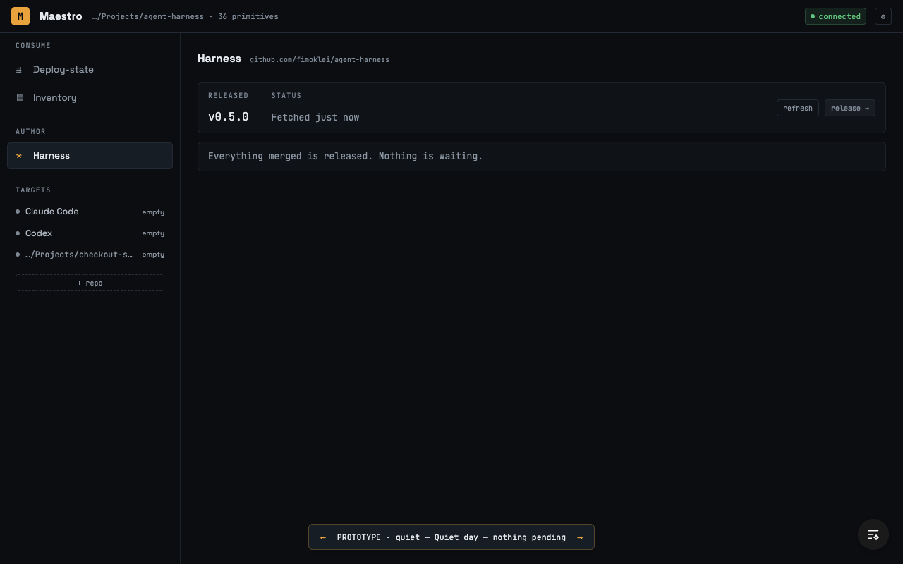
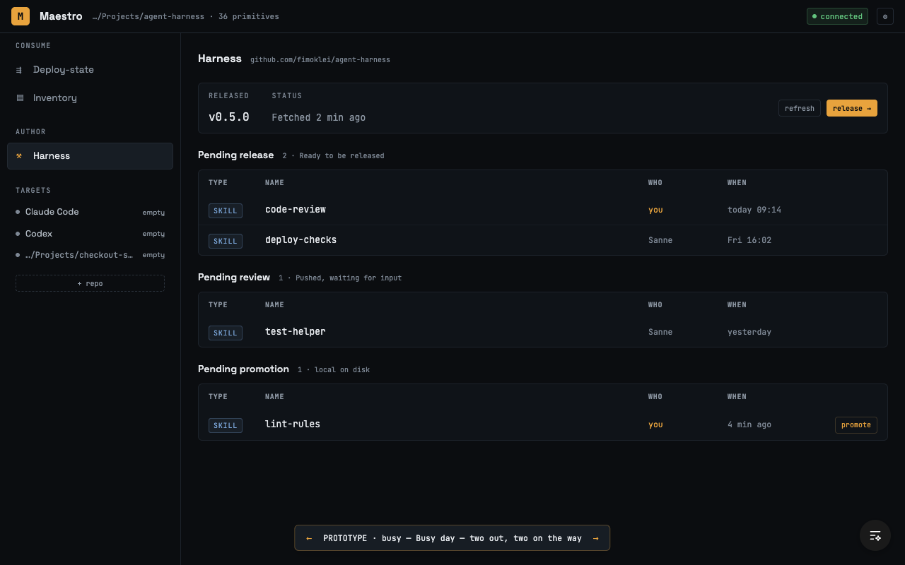
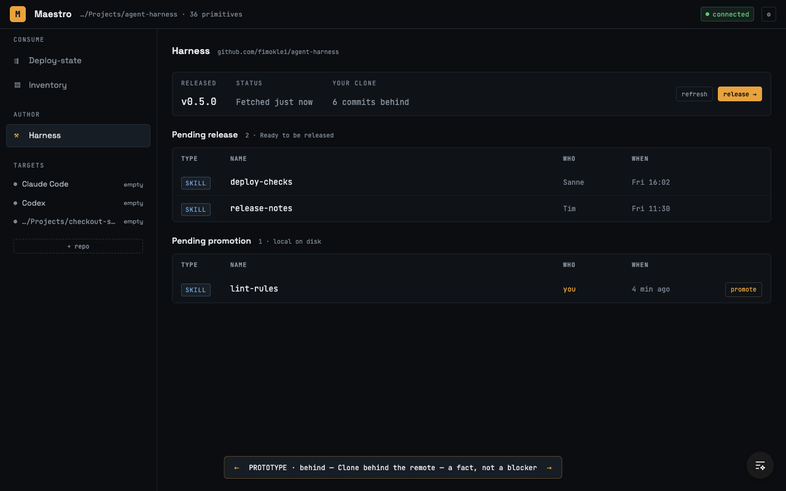
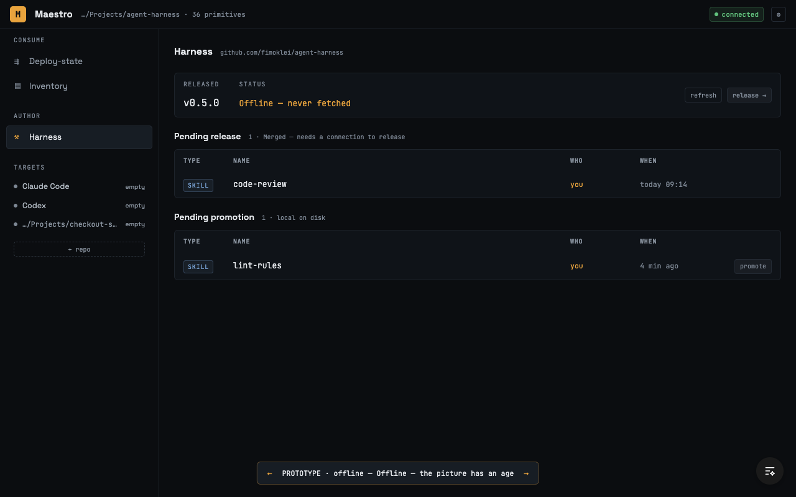
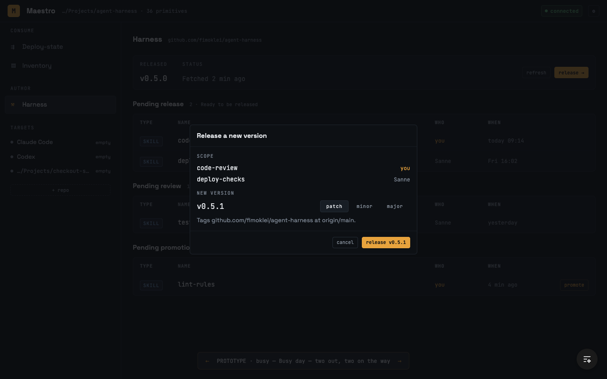

# Prototype — the Harness view (issue #347)

Throwaway. One design, not a set of variants. The sketch's code never merged and
its branch is gone; the screenshots and the decisions below are what was kept.

Issue [#347](https://github.com/fimoklei/maestro/issues/347), on wayfinder map
[#343](https://github.com/fimoklei/maestro/issues/343). Route:
[#399](https://github.com/fimoklei/maestro/issues/399).

## Why there is only one design

The ticket's first run produced five variants (A–E) and no choice: each new fact
produced another sketch, and the last three sessions polished one of them instead
of deciding. Those variants and their branch were deleted on 2026-07-28. This
sketch was built after the route existed, from a grilling that settled the layout
before any pixel — so the switcher cycles **states of one design**, not competing
designs.

## The four states

The sketch ran at `/prototype/harness`, gated on `import.meta.env.PROD`, with
`←` / `→` cycling four states. Read them from the screenshots below.

| State | What it tests |
|---|---|
| `quiet` | A day with nothing pending — the hardest case for a home base |
| `busy` | Two changes ready, two on the way, split across the three sections |
| `behind` | A clone 6 commits behind: a fact, not a blocker (#399) |
| `offline` | A stale picture, and both push-bound actions dead |

## What the design says

- **A home base, not a task screen.** It leads with state and reads on a quiet
  day. Step 5 of the route is not a step but the view the others depart from.
- **The subject is the harness**, not "my work". A tag covers the repo, so a
  release ships the team's merged work; a "my work" screen would hide that. Your
  own rows are marked with an amber `you` in the Who column.
- **A row is a movement since the last release**, never the full skill list —
  that is Inventory's question, and duplicating it sank variant D.
- **Three tables, each named for the state it holds**: Pending release, Pending
  review, Pending promotion. No row repeats its own state; an empty section is
  simply absent.
- **Actions live where their subject lives.** `promote` acts on one change, so it
  is a row control. `release` acts on the whole repo, so it sits on the strip and
  opens a dialog — the pattern `RemoveSkillDialog` uses: state the consequences,
  then act.
- **No gate list.** Maestro gates nothing (#365, #399). An earlier variant showed
  release checks it never runs.
- **Offline both push-bound actions go dead** and the heading stops claiming the
  work is ready. `refresh` stays live.

## Screens

| | |
|---|---|
|  | `?state=quiet` |
|  | `?state=busy` |
|  | `?state=behind` |
|  | `?state=offline` |
|  | the release dialog |

## Known open ends

- **Column headers repeat** once per table — three header rows above four data
  rows on a busy day.
- **The version proposal takes a position on #350**, which is still open. The
  dialog computes the next version and offers patch / minor / major.
- **Offline is one state here, and it is really two**: no network, versus a fetch
  that failed (no rights, expired token, repo moved). Killing a button is right
  for the first and arguably a gate for the second.
