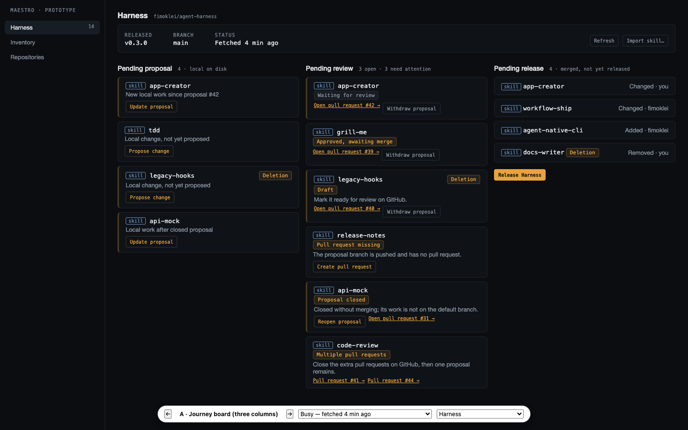
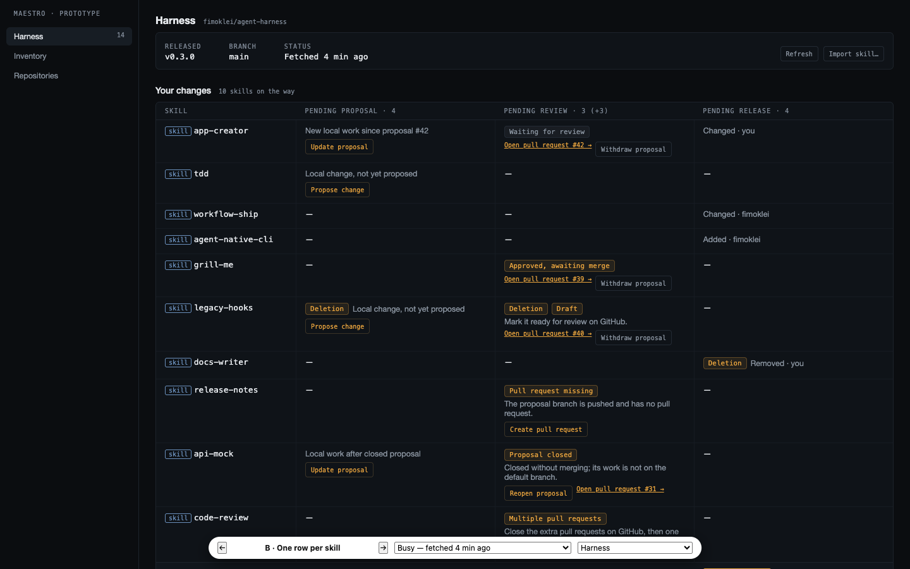
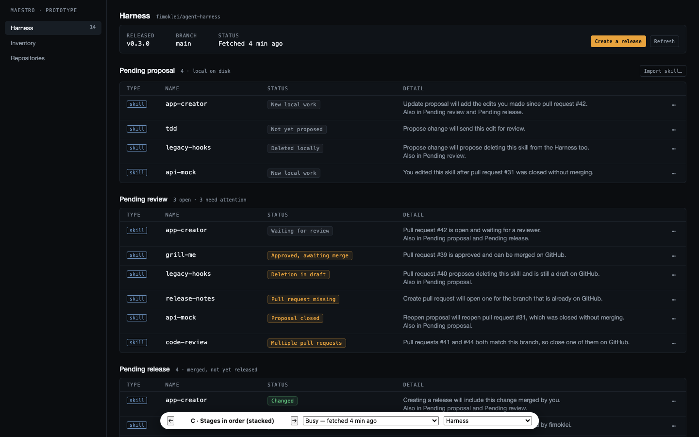
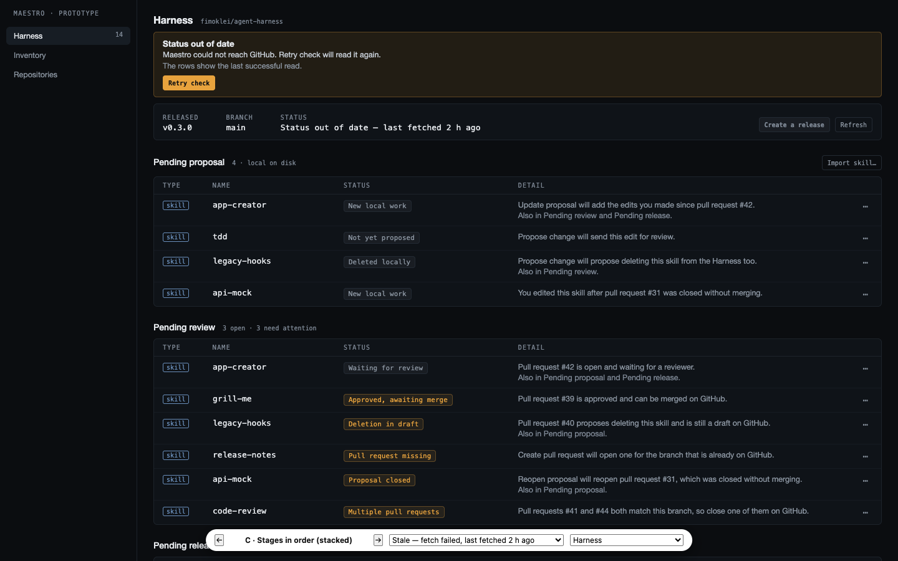
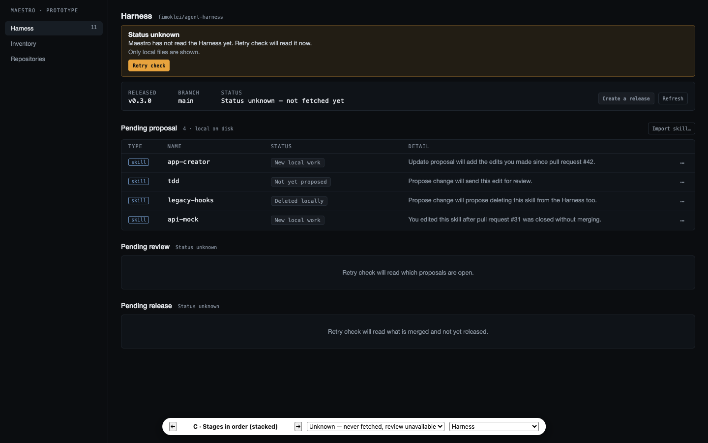
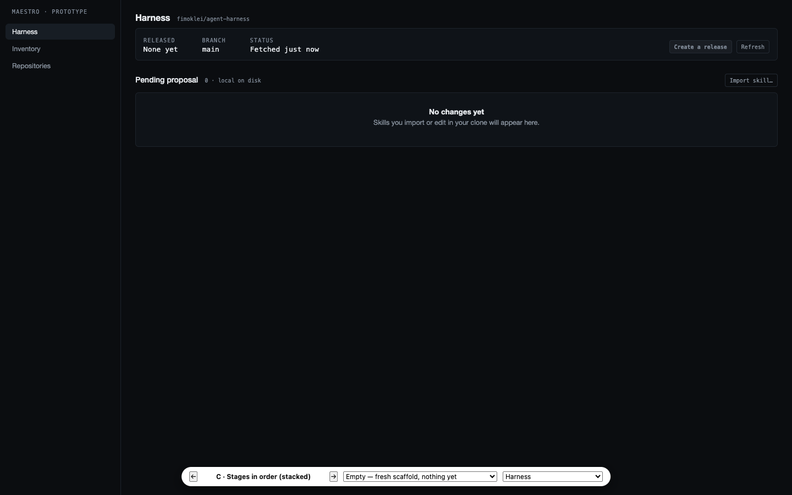
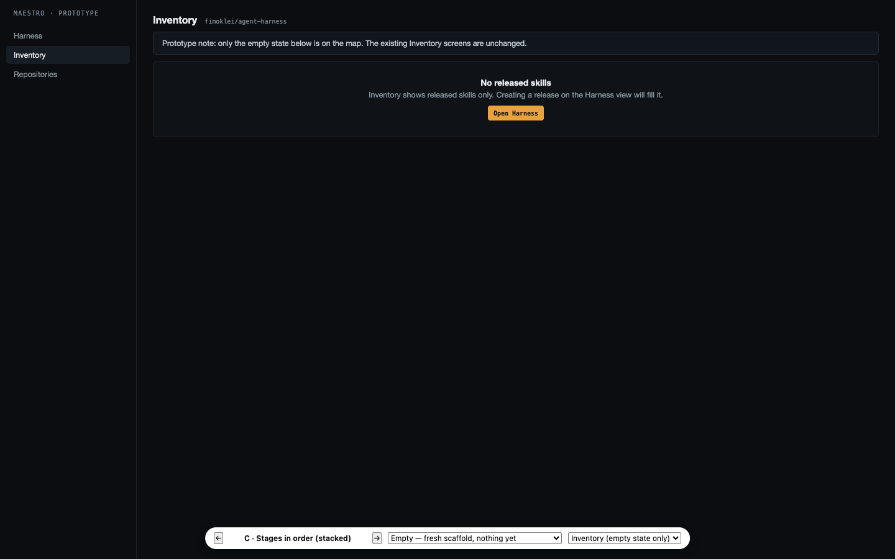

# Prototype — the author's journey on the Harness view (issue #810)

Throwaway. Three structurally different variants, one winner, refined with
Michiel over one session on 2026-09-06. The code is
`packages/web/prototype-harness-journey.html` on this branch and never merges;
the screenshots and the decisions below are the record.

Issue [#810](https://github.com/fimoklei/maestro/issues/810), on wayfinder map
[#805](https://github.com/fimoklei/maestro/issues/805). Stages:
[#808](https://github.com/fimoklei/maestro/issues/808). Actions:
[#809](https://github.com/fimoklei/maestro/issues/809).

## The three variants

| Variant | Shape | Verdict |
|---|---|---|
| A · Journey board | Three columns left to right, one card per stage a skill is in | Rejected without comment; Michiel reacted to C only |
| B · One row per skill | One table, the three stages as columns | Rejected without comment |
| **C · Stages in order** | Three stacked sections in journey order, one shared strip | **Chosen**, then refined in six rounds |

 

## What C settled

- **Forward order, three tables.** Pending proposal → Pending review → Pending
  release, top to bottom. The current view runs the other way (`harness-view.tsx:209`).
- **One shape for every table:** Type · Name · Status · Detail · ⋯. The third
  column is always **Status**, also for Pending release.
- **A skill in several stages is one row per stage**, tied together by an
  "Also in Pending review and Pending release." line in Detail. No chip, no
  hover.
- **Detail** is a column, one sentence, always visible, carrying the cause and
  the next step with the control named. Hover tooltips were tried and rejected:
  unreliable and invisible.
- **Actions live in a ⋯ menu per row**, the `ActionsMenu` Inventory already
  uses. Links to pull requests are menu items too.
- **Release** is the strip's single amber action, labelled **Create a release**.
  **Import skill…** moves to the Pending proposal header, right-aligned.
- **A deletion reads as one status per stage**, never as a chip beside another
  status: *Deleted locally* → *Deletion in draft* / *Deletion waiting for
  review* / *Deletion approved, awaiting merge* → *Deleted*.
- **Colour:** amber only where the author must act outside the normal flow
  (Draft, Approved, Pull request missing, Proposal closed, Multiple pull
  requests). Waiting and local states grey; merged green. Red never.
- **Failed and unknown reads** use the existing `Notice` component, unchanged:
  heading · sentence · detail · one action (**Retry check**). With no previous
  read, Pending review and Pending release show *Status unknown* and no rows.
- **Inventory:** the existing screens stay as they are. The one addition is the
  released-only empty state, *No released skills*, pointing at the Harness view.
- **The layout was not the fault** behind the map's gaps; every gap survived
  unchanged into C. The shape of the screen is settled.

## Screens

| | |
|---|---|
|  | `?scenario=busy` — every reading from #808 and #809 on one screen |
|  | `?scenario=stale` — Status out of date, mutations closed |
|  | `?scenario=unknown` — never fetched, review unavailable |
|  | `?scenario=empty` — a fresh scaffold |
|  | `?screen=inventory` — the released-only empty state |

## Copy

The nineteen Detail and notice sentences in the prototype were approved line by
line; take them verbatim into the copy module. Two more, in the unknown
scenario, are still unreviewed: *Retry check will read which proposals are
open.* and *Retry check will read what is merged and not yet released.*

## Open ends

- `CONTEXT.md` says **Plan release**; the prototype says **Create a release**.
- Two words for one concept: *Deleted* (locally, in review) against *Removed*
  (Pending release today). The prototype uses *delete* everywhere.
- The fonts in the prototype are fallbacks: `file://` loads no `@fontsource`.
